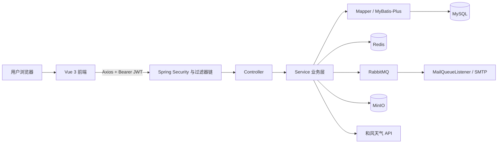
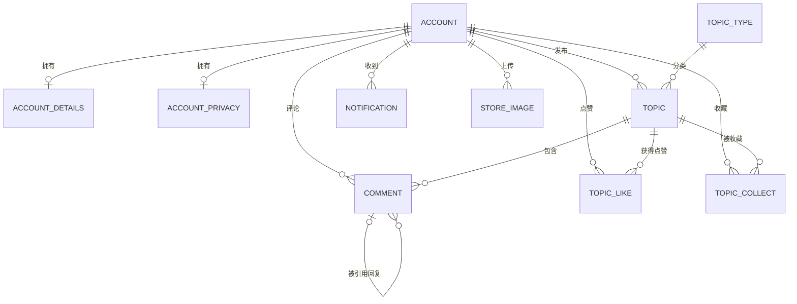
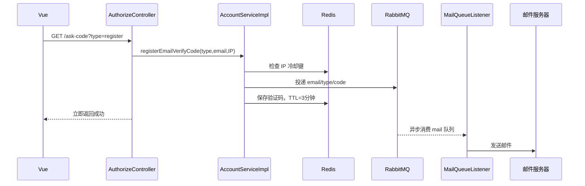

# SpringBoot + Vue 校园论坛 Code Wiki

> 面向第一次系统阅读前后端分离项目的学习笔记。本文以**后端主线**为重点，前端只解释页面、状态和接口如何衔接。
>
> 分析基于当前仓库源码，而不是只依据 README。文档最后专门列出了“代码实际情况与项目描述/初始化文件不一致”的部分。

---

## 1. 先用一句话理解项目

这是一个前后端分离的校园论坛：Vue 负责页面与交互，Spring Boot 提供 REST API；MySQL 保存长期业务数据，Redis 保存验证码、限流计数、短期缓存和待落库的点赞/收藏，RabbitMQ 异步发送验证码邮件，MinIO 保存头像与帖子图片，和风天气提供实时天气。

如果只记一条主线，可以记成：

```text
浏览器(Vue)
  -> HTTP + JWT
  -> Spring Security/过滤器
  -> Controller 接收参数
  -> Service 编排业务
  -> Mapper/MyBatis-Plus 操作 MySQL
  -> Redis / RabbitMQ / MinIO / 和风天气等外部组件
  -> RestBean 统一返回 JSON
```

## 2. 项目能做什么

### 2.1 已实现的核心业务

- 邮箱验证码注册、登录、退出登录、忘记密码与重置密码。
- 用户基本资料、联系方式、头像、邮箱、密码和隐私开关管理。
- 帖子分类、列表分页、置顶列表、详情、发布和编辑。
- Quill 富文本编辑，正文以 Delta JSON 保存，支持粘贴/上传图片。
- 评论帖子、引用回复评论、删除自己的评论和回复通知。
- 点赞、收藏以及“我的收藏”。
- 根据经纬度查询实时天气和未来数小时天气。
- 统一响应、参数校验、JWT 鉴权、请求日志、请求 ID、跨域及部分限流。

### 2.2 技术栈速查

| 层次 | 技术 | 在项目中的用途 |
|---|---|---|
| 后端基础 | Java 17、Spring Boot 3.1.2 | 应用容器、依赖注入、配置和 Web API |
| Web | Spring MVC | Controller、参数绑定、JSON 响应、文件上传 |
| 权限 | Spring Security 6 + java-jwt | 登录认证、JWT 签发/解析、接口访问控制 |
| 持久层 | MyBatis-Plus 3.5.3.1 | CRUD、条件构造器和分页 |
| 主数据库 | MySQL 8 | 用户、帖子、评论、通知、互动等长期数据 |
| 缓存 | Redis | 验证码、限流、JWT 黑名单、天气/帖子缓存、互动缓冲 |
| 消息队列 | RabbitMQ | 将验证码邮件发送与 HTTP 请求解耦 |
| 对象存储 | MinIO | 头像和帖子正文图片 |
| 外部服务 | 和风天气 API | 城市解析和天气查询 |
| 文档/日志 | springdoc-openapi、Logback | Swagger UI、请求链路日志和滚动文件日志 |
| 前端 | Vue 3、Vite、Vue Router、Pinia | 页面、路由和全局状态 |
| UI/网络 | Element Plus、Axios | UI 组件和 HTTP 请求 |
| 富文本 | Vue Quill、Delta、quill-delta-to-html | 编辑、存储并渲染帖子和评论 |

### 2.3 整体架构与组件依赖



模块依赖方向基本是单向的：Controller 依赖 Service，Service 依赖 Mapper 和基础设施工具，Mapper 依赖数据库实体。Controller 不应直接操作 Mapper，Mapper 也不应反过来调用 Service。`TopicServiceImpl` 是依赖最多的业务类，因为它要组合账号、资料、隐私、帖子、评论、通知、Redis 缓存和互动表。

## 3. 仓库目录与职责

```text
campus-forum-springboot-vue/
├── CODE_WIKI.md                 # 本文档
├── README.md                    # 原项目简介
├── database.sql                 # MySQL 初始化脚本（当前版本不完整，见第 15 节）
├── infra/
│   └── docker-compose.yml       # MySQL/Redis/RabbitMQ/MinIO 开发环境
├── my-project-backend/
│   ├── pom.xml                  # Maven 依赖、Java 版本、dev/prod profile
│   └── src/main/
│       ├── java/com/example/
│       │   ├── config/          # Security、Web、MinIO、RabbitMQ、Swagger 配置
│       │   ├── controller/      # HTTP 接口入口
│       │   ├── entity/          # DTO、请求 VO、响应 VO、统一响应
│       │   ├── filter/          # JWT、日志、CORS、限流过滤器
│       │   ├── listener/        # RabbitMQ 邮件消费者
│       │   ├── mapper/          # MyBatis-Plus Mapper 和自定义 SQL
│       │   ├── service/         # 业务接口
│       │   ├── service/impl/    # 业务实现
│       │   └── utils/           # JWT、缓存、限流、雪花 ID 等工具
│       └── resources/
│           ├── application.yml
│           ├── application-dev.yml
│           ├── application-prod.yml
│           └── logback-spring.xml
└── my-project-frontend/
    ├── package.json
    └── src/
        ├── components/          # 编辑器、天气、收藏等复用组件
        ├── net/                 # Axios 与 Token 封装
        ├── router/              # 页面路由和登录守卫
        ├── store/               # Pinia 用户/论坛类型状态
        └── views/               # 登录、论坛、详情、设置页面
```

## 4. 后端分层：每层到底做什么

### 4.1 Controller：接请求，不承担复杂业务

Controller 的典型职责是：

1. 用 `@GetMapping` / `@PostMapping` 声明 URL。
2. 从查询参数、JSON 请求体或 request attribute 中取值。
3. 用 `@Valid`、`@Min`、`@Email` 等做入口校验。
4. 调用 Service。
5. 用 `RestBean` 包装结果。

例如发帖：

```java
@PostMapping("/create-topic")
public RestBean<Void> createTopic(@Valid @RequestBody TopicCreateVO vo,
                                  @RequestAttribute(Const.ATTR_USER_ID) int id) {
    return utils.messageHandle(() -> topicService.createTopic(id, vo));
}
```

这里 Controller 不判断帖子类型、长度或发帖频率，这些属于业务规则，交给 `TopicServiceImpl.createTopic()`。

### 4.2 Service：项目真正的业务中心

Service 负责把多步操作组织成一个有业务含义的动作。例如“注册”不是简单 `INSERT`，而是：

```text
检查验证码 -> 检查邮箱/用户名唯一性 -> BCrypt 加密密码
-> 插入账号 -> 初始化隐私记录 -> 初始化详细资料 -> 删除验证码
```

接口放在 `service/*.java`，实现放在 `service/impl/*.java`。接口让 Controller 依赖抽象，也便于以后替换实现或写测试。

### 4.3 Mapper：数据库访问层

所有 Mapper 都继承 `BaseMapper<T>`，所以自动拥有常见 CRUD：

| 方法 | SQL 含义 | 本项目示例 |
|---|---|---|
| `insert(entity)` | `INSERT` 新增一行 | 新增评论、隐私记录 |
| `selectById(id)` | 按主键 `SELECT` | 查用户、帖子、被引用评论 |
| `selectList(wrapper)` | 按条件查多行 | 查帖子分类、置顶帖子 |
| `selectPage(page, wrapper)` | 分页查询 | 帖子列表、评论列表 |
| `update(null, wrapper)` | 按条件更新字段 | 编辑帖子 |
| `delete(wrapper)` | 按条件删除 | 删除自己的评论 |

`TopicMapper` 还有自定义 SQL，用于批量写入/删除点赞收藏、统计互动数和查询收藏帖子。

### 4.4 DTO 与 VO：为什么看起来有很多“实体类”

这是初学时最容易混乱的地方。这个项目中的对象可以按“它在哪一段路上”来记：

```text
前端提交 JSON
    -> Request VO（只接收允许提交的字段）
    -> Service
    -> DTO（对应数据库表）
    -> Mapper / MySQL

MySQL 查询 DTO
    -> Service 补充/裁剪字段
    -> Response VO（只返回页面需要的字段）
    -> RestBean
    -> 前端 JSON
```

- **DTO**：这里主要指 `entity/dto` 下与数据库表对应的对象。
- **Request VO**：接收前端输入，携带参数校验规则。
- **Response VO**：返回前端，避免暴露密码等敏感字段，也能组合多张表的数据。
- **RestBean**：最外层统一响应壳。

## 5. 实体类完整记忆表

### 5.1 数据库 DTO

| 类 | 对应表/存储 | 主要字段 | 业务意义 |
|---|---|---|---|
| `Account` | `db_account` | id、username、password、email、role、avatar、registerTime | 登录身份和账号主表；密码只应在后端使用 |
| `AccountDetails` | `db_account_details` | id、gender、phone、qq、wx、desc | 用户可编辑的扩展资料；id 与账号 id 一一对应 |
| `AccountPrivacy` | `db_account_privacy` | id、phone、email、wx、qq、gender | 每个资料字段是否允许其他用户看到 |
| `Topic` | `db_topic` | id、title、content、type、time、uid | 帖子主记录；content 保存 Delta JSON 字符串 |
| `TopicType` | `db_topic_type` | id、name、desc、color | 帖子分类与前端展示色 |
| `TopicComment` | `db_topic_comment` | id、uid、tid、content、time、quote | 评论；`tid` 指帖子，`quote` 指被回复评论，非回复时约定小于等于 0 |
| `Notification` | `db_notification` | id、uid、title、content、type、url、time | 评论/回复产生的站内未读通知 |
| `StoreImage` | `db_image_store` | uid、name、time | 记录正文图片由谁上传、对象名和上传时间 |
| `Interact` | Redis + 互动表 | tid、uid、time、type | 点赞/收藏的临时业务对象；不是直接映射一张固定表 |

记忆关系：账号是中心，资料和隐私是它的两个一对一附表；账号发布帖子，帖子拥有评论；账号对帖子产生点赞/收藏；评论可能引用另一条评论，并给目标用户产生通知。



### 5.2 请求 VO：前端能提交什么

| 类 | 用于 | 关键校验/字段 |
|---|---|---|
| `EmailRegisterVO` | 注册 | 邮箱、6 位验证码、1~10 位用户名、6~20 位密码 |
| `ConfirmResetVO` | 验证重置验证码 | 邮箱、6 位验证码 |
| `EmailResetVO` | 真正重置密码 | 邮箱、验证码、新密码 |
| `ModifyEmailVO` | 绑定新邮箱 | 新邮箱、验证码 |
| `ChangePasswordVO` | 已登录用户改密码 | 原密码、新密码 |
| `DetailsSaveVO` | 保存资料 | 用户名、性别、手机、QQ、微信、简介 |
| `PrivacySaveVO` | 改一个隐私开关 | type 只能是 phone/email/qq/wx/gender，外加 status |
| `TopicCreateVO` | 发帖 | 分类、1~30 字标题、Delta JSON 正文 |
| `TopicUpdateVO` | 编辑帖子 | 帖子 id、分类、标题、Delta JSON 正文 |
| `AddCommentVO` | 评论/回复 | 帖子 id、Delta 字符串、被引用评论 id |

`@Valid` 只负责格式和范围，不负责全部业务规则。例如“帖子分类 id 是否真实存在”必须由 Service 查询/缓存分类后判断。

### 5.3 响应 VO：页面最终拿到什么

| 类 | 页面用途 | 组合特点 |
|---|---|---|
| `AuthorizeVO` | 登录成功 | 用户名、角色、JWT、过期时间 |
| `AccountVO` | 顶部用户信息 | 不含 password |
| `AccountDetailsVO` | 个人资料设置 | 资料字段，不含账号敏感字段 |
| `AccountPrivacyVO` | 隐私设置 | 5 个布尔开关 |
| `TopicTypeVO` | 分类栏 | id、名称、描述、颜色 |
| `TopicPreviewVO` | 帖子列表卡片 | 帖子 + 作者 + 摘要 + 图片 + 点赞/收藏数 |
| `TopicTopVO` | 置顶列表 | 只含 id、标题、时间 |
| `TopicDetailVO` | 帖子详情 | 帖子 + 过滤隐私后的作者 + 当前用户互动状态 + 评论数 |
| `CommentVO` | 评论列表 | 评论 + 被引用摘要 + 过滤隐私后的评论者 |
| `NotificationVO` | 消息弹窗 | 标题、正文、类型、跳转 URL、时间 |
| `WeatherVO` | 天气卡片 | location、now、未来 5 条 hourly 原始 JSON |

### 5.4 `BaseData.asViewObject()` 是什么意思

`Account` 等 DTO 实现了 `BaseData`。它通过反射把**同名字段**复制到指定 VO：

```java
AccountVO vo = account.asViewObject(AccountVO.class);
```

可理解成简化版属性映射器：`Account.id -> AccountVO.id`、`Account.email -> AccountVO.email`；目标类没有 `password` 字段，所以密码不会被复制。

优点是代码短；限制也很明显：

- 只复制同名字段，改名后会静默跳过。
- 异常被部分忽略，编译器无法检查映射完整性。
- 依赖反射，排查问题不如 MapStruct 或显式转换直观。

## 6. Controller 与接口总览

除登录注册、公开图片和 Swagger 外，当前 Security 配置要求请求拥有 `ROLE_user`。前端需发送：

```http
Authorization: Bearer <token>
```

### 6.1 认证 `AuthorizeController` + Security 登录处理器

| 方法 | URL | 请求 | 作用 |
|---|---|---|---|
| GET | `/api/auth/ask-code` | email、type | 申请 register/reset/modify 验证码 |
| POST | `/api/auth/register` | `EmailRegisterVO` | 邮箱注册 |
| POST | `/api/auth/reset-confirm` | `ConfirmResetVO` | 先验证重置验证码 |
| POST | `/api/auth/reset-password` | `EmailResetVO` | 重置密码 |
| POST | `/api/auth/login` | form username、password | Spring Security 内置登录过滤器处理，不在 Controller 中 |
| GET | `/api/auth/logout` | JWT | 将 token 的 jti 加入 Redis 黑名单 |

### 6.2 用户 `AccountController`

| 方法 | URL | 作用 |
|---|---|---|
| GET | `/api/user/info` | 当前账号概要 |
| GET | `/api/user/details` | 当前用户扩展资料 |
| POST | `/api/user/save-details` | 更新用户名和扩展资料 |
| POST | `/api/user/modify-email` | 验证后修改邮箱 |
| POST | `/api/user/change-password` | 验证原密码后修改密码 |
| GET | `/api/user/privacy` | 获取隐私设置 |
| POST | `/api/user/save-privacy` | 更新单项隐私开关 |

### 6.3 论坛 `ForumController`

| 方法 | URL | 作用 |
|---|---|---|
| GET | `/api/forum/weather` | 按经纬度查天气 |
| GET | `/api/forum/types` | 分类列表 |
| POST | `/api/forum/create-topic` | 发帖 |
| GET | `/api/forum/list-topic` | 分类分页列表；前端页码从 0 开始 |
| GET | `/api/forum/top-topic` | 置顶帖 |
| GET | `/api/forum/topic` | 帖子详情和当前用户互动状态 |
| GET | `/api/forum/interact` | 设置点赞/收藏状态 |
| GET | `/api/forum/collects` | 我的收藏 |
| POST | `/api/forum/update-topic` | 仅按帖子 id + 当前 uid 更新自己的帖子 |
| POST | `/api/forum/add-comment` | 评论或回复 |
| GET | `/api/forum/comments` | 每页 10 条评论 |
| GET | `/api/forum/delete-comment` | 仅按评论 id + 当前 uid 删除自己的评论 |

### 6.4 图片与通知

| Controller | URL | 作用 |
|---|---|---|
| `ImageController` | POST `/api/image/cache` | 上传帖子图片，单文件最多 6MB，每用户每小时最多 20 次 |
| `ImageController` | POST `/api/image/avatar` | 上传头像，最多约 1MB，并删除旧头像 |
| `ObjectController` | GET `/images/**` | 从 MinIO 流式读取图片，浏览器缓存 30 天 |
| `NotificationController` | GET `/api/notification/list` | 当前用户通知 |
| `NotificationController` | GET `/api/notification/delete` | 删除当前用户的一条通知 |
| `NotificationController` | GET `/api/notification/delete-all` | 清空当前用户通知 |

## 7. 关键业务链路详解

### 7.1 注册验证码为什么要 Redis + RabbitMQ

调用链：



`registerEmailVerifyCode()` 的返回约定是：`null` 代表成功，字符串代表失败原因。`ControllerUtils.messageHandle()` 把这种约定统一转换成 `RestBean`。

RabbitMQ 的价值不是让邮件“更快”，而是让接口不用同步等待 SMTP；即使邮件服务暂时慢，任务可以先积压在 durable 队列中。

### 7.2 注册到底做了哪些 CRUD

`AccountServiceImpl.registerEmailAccount()`：

1. `GET Redis`：取邮箱验证码。
2. `SELECT EXISTS`：查邮箱是否存在。
3. `SELECT EXISTS`：查用户名是否存在。
4. `BCryptPasswordEncoder.encode()`：密码单向哈希，数据库不存明文。
5. `INSERT db_account`：新建账号。
6. `INSERT db_account_privacy`：初始化隐私开关。
7. `INSERT db_account_details`：初始化资料空记录。
8. `DELETE Redis key`：验证码使用后立即作废。

这就是“业务方法”和“单表 CRUD”的区别：一个注册动作通常跨多个存储步骤。

### 7.3 登录、JWT 校验与退出

登录 URL 虽然是 `/api/auth/login`，但没有对应 Controller 方法，因为 `SecurityConfiguration.formLogin()` 注册的 Spring Security 过滤器接管了它。

```text
POST /api/auth/login
-> Security 读取 username/password
-> AccountServiceImpl.loadUserByUsername()
-> 查 db_account
-> BCrypt 比对密码
-> successHandler
-> JwtUtils.createJwt()
-> 返回 AuthorizeVO(token, expire, ...)
```

JWT 中放了：

- `jti`：token 唯一 ID，用于黑名单。
- `id`：用户主键。
- `name`：用户名。
- `authorities`：权限，如 `ROLE_user`。
- `iat` / `exp`：签发和过期时间。

后续请求先经过 `JwtAuthenticationFilter`：解析 `Authorization`，验签、检查过期和 Redis 黑名单，然后把认证放入 `SecurityContextHolder`，同时执行：

```java
request.setAttribute(Const.ATTR_USER_ID, utils.toId(jwt));
```

因此 Controller 才能用 `@RequestAttribute("userId") int id` 安全取得当前用户 id，而不是相信前端随便传来的 uid。

退出时不会删除客户端已经拿到的 JWT，而是把它的 `jti` 写入 Redis，TTL 等于 token 剩余寿命；以后解析时命中黑名单就拒绝。

### 7.4 保存用户资料：`saveOrUpdate` 怎么理解

`AccountDetailsServiceImpl.saveAccountDetails()` 先检查新用户名是否属于别人，然后在一个事务中：

```text
UPDATE db_account SET username=? WHERE id=?
-> saveOrUpdate(AccountDetails)
```

`saveOrUpdate` 根据主键判断：没有该 id 就 `INSERT`，已有就 `UPDATE`。这里注册时已初始化详情记录，所以正常情况是更新；保留 `saveOrUpdate` 能兼容旧用户缺少详情行的情况。

方法加了 `@Transactional`，任一步抛出运行时异常时可整体回滚；`synchronized` 只在单个 JVM 内串行执行，无法代替数据库唯一索引或分布式锁。

### 7.5 隐私设置如何影响帖子作者和评论者

`AccountPrivacy.hiddenFields()` 用反射找出值为 `false` 的字段名。例如 phone=false，会得到 `"phone"`。

`TopicServiceImpl.fillUserDetailByPrivacy()` 查询账号、详情和隐私，再执行：

```java
BeanUtils.copyProperties(account, target, ignores);
BeanUtils.copyProperties(details, target, ignores);
```

被列入 `ignores` 的同名字段不会复制到 `TopicDetailVO.User` 或 `CommentVO.User`，前端收到 null 后显示“已隐藏或未填写”。这属于**服务端字段级隐私裁剪**，比只在前端隐藏更可靠。

### 7.6 发帖、Delta 与列表缓存

`TopicServiceImpl.createTopic()` 的步骤：

1. 遍历 Delta `ops`，限制正文长度 20000。
2. 检查分类 id 是否在启动时加载的分类集合中。
3. Redis 限制每用户每小时最多发 3 帖。
4. `BeanUtils.copyProperties(vo, topic)` 复制标题和分类。
5. 把 Delta JSON 序列化为字符串，补 uid、时间。
6. `INSERT db_topic`。
7. 删除所有 `topic:preview:*` 列表缓存。

为什么不直接存 HTML？Delta 是描述编辑动作/内容的结构化 JSON，例如：

```json
{
  "ops": [
    { "insert": "你好，论坛！\n" },
    { "insert": { "image": "/images/cache/20260820/abc" } }
  ]
}
```

列表不需要完整富文本。`resolveToPreview()` 遍历 `ops`：普通文本拼成最多 300 字摘要，图片地址收集到 `images`，然后补作者、点赞数和收藏数，组成 `TopicPreviewVO`。

列表缓存采用 Cache-Aside：

```text
GET topic:preview:<page>:<type>
  -> 命中：反序列化并返回
  -> 未命中：查 MySQL -> 组装 VO -> SET Redis TTL 60秒 -> 返回
```

### 7.7 点赞/收藏为什么先写 Redis 再落 MySQL

直接对每次点击执行 `INSERT/DELETE` 会让高频互动不断写数据库。当前实现把最终状态先放进 Redis Hash：

```text
Hash 名：like 或 collect
field：<tid>:<uid>
value：true 或 false
```

第一次变化会安排一个 3 秒后的任务。任务把 `true` 批量 `insert ignore` 到 `db_topic_interact_like/collect`，把 `false` 批量删除，然后清空 Hash。

这是一种**写合并/削峰**：同一用户 3 秒内反复点按，最终只需要落一次最终状态。`hasInteract()` 查询时也先看 Redis 中尚未落库的新状态，未找到才查 MySQL，因此用户能立即看到结果。

需要理解它的取舍：它是最终一致性而非强一致性；应用在 3 秒窗口内异常退出时，当前内存调度任务可能来不及落库。第 15 节列出了生产化改进方向。

### 7.8 评论、引用回复与通知

`createComment()`：

1. 解析评论 Delta，限制 2000 字。
2. Redis 限制每用户每分钟最多 2 条。
3. 插入 `db_topic_comment`。
4. 若 `quote > 0`，查被引用评论并通知评论作者。
5. 否则通知帖子作者。
6. 自己回复自己时不发通知。

`comments()` 每页查 10 条。若评论引用另一条评论，会再次查询原评论，从它的 Delta 中提取文本摘要；原评论已删除时返回“此评论已被删除！”。随后同样按隐私设置组装评论者信息。

删除评论使用 `WHERE id=? AND uid=?`，即使用户篡改评论 id，也只能删自己的记录。这是很重要的对象级权限校验思路。

### 7.9 图片上传与访问

正文图片：

```text
Vue Quill 粘贴/选择图片
-> POST /api/image/cache
-> 检查 6MB + 每小时 20 次
-> MinIO study bucket: /cache/yyyyMMdd/<UUID>
-> db_image_store 记录上传者/对象名/时间
-> 返回对象路径，写入 Delta
```

头像路径为 `/avatar/<UUID>`。上传新头像后删除 MinIO 中旧对象，再更新 `db_account.avatar`。

前端实际访问 `${backend}/images${avatar}`，`ObjectController` 去 MinIO 读取对应对象并写入响应流，所以浏览器不直接知道 MinIO 凭据。

### 7.10 天气缓存

每次天气请求先通过经纬度调用城市查询接口得到 location id，再用 `weather:cache:v2:<locationId>` 查 Redis。命中直接返回；未命中调用实时天气和 24 小时预报接口，只保留前 5 条 hourly，缓存 1 小时。

以城市 id 而不是精确经纬度作为 key，可让同一城市内的用户共享缓存，显著减少第三方 API 次数。不过当前实现仍会在每次请求时先调用一次城市查询接口。

## 8. 关键类与函数索引

### 8.1 业务服务

| 类/方法 | 核心作用 |
|---|---|
| `AccountServiceImpl.loadUserByUsername` | 给 Spring Security 查询用户和角色 |
| `registerEmailVerifyCode` | 验证码限流、生成、入队并写 Redis |
| `registerEmailAccount` | 验证并创建账号及两个附属记录 |
| `resetConfirm` / `resetEmailAccountPassword` | 校验验证码并更新密码 |
| `modifyEmail` / `changePassword` | 登录后的账号安全修改 |
| `AccountDetailsServiceImpl.saveAccountDetails` | 事务更新用户名和资料 |
| `AccountPrivacyImpl.savePrivacy` | 按 type 更新一个隐私布尔值 |
| `TopicServiceImpl.createTopic` | 校验、限流、保存帖子、清缓存 |
| `listTopicByPage` | Redis 缓存 + MySQL 分页 + 预览组装 |
| `getTopic` | 详情、作者隐私、互动状态和评论数 |
| `interact` / `saveInteract` | 点赞收藏写缓冲与批量落库 |
| `createComment` / `comments` | 评论、引用摘要和通知 |
| `ImageServiceImpl.uploadImage` | 正文图片限流、MinIO 上传和元数据记录 |
| `uploadAvatar` | 上传新头像、删除旧对象、更新账号 |
| `WeatherServiceImpl.fetchWeather` | 城市定位、天气查询和缓存 |
| `NotificationServiceImpl` | 用户通知的增删查 |

### 8.2 基础设施与工具

| 类/方法 | 核心作用 |
|---|---|
| `SecurityConfiguration.filterChain` | 公开路径、角色要求、无状态会话及过滤器顺序 |
| `JwtAuthenticationFilter` | 请求 JWT -> Security 身份 + userId attribute |
| `JwtUtils.createJwt/resolveJwt` | JWT 签发、验签、过期和黑名单检查 |
| `RequestLogFilter` | 生成雪花请求 ID，记录 URL、身份、参数、耗时和响应 |
| `CorsFilter` | 添加跨域响应头 |
| `FlowLimitingFilter` / `FlowUtils` | Redis 计数、冷却和封禁策略 |
| `CacheUtils` | 对象/列表 JSON 缓存及按 pattern 删除 |
| `ControllerUtils.messageHandle` | `null=成功，字符串=错误` 转统一响应 |
| `RestBean` | `{id, code, data, message}` JSON 响应协议 |
| `SnowflakeIdGenerator.nextId` | 生成一次请求的全局跟踪 id |
| `MailQueueListener.sendMailMessage` | 消费 mail 队列并按业务类型发送邮件 |

## 9. 请求经过过滤器的顺序

相关顺序可概括为：

```text
CorsFilter（@Order -102）
-> FlowLimitingFilter（@Order -101）
-> Spring Security FilterChain
   -> JwtAuthenticationFilter
   -> RequestLogFilter
   -> UsernamePasswordAuthenticationFilter / 授权检查
-> Controller
```

JWT 在日志过滤器之前，因此合法 token 的 userId 和身份会进入日志。`RequestLogFilter` 把雪花 ID 写入 MDC 的 `reqId`，`RestBean` 也读取这个值作为响应 id，于是前端报告响应 id 后，可以在日志里定位同一次请求。

统一响应示意：

```json
{
  "id": 123456789012345,
  "code": 200,
  "data": { "username": "demo" },
  "message": "请求成功"
}
```

注意这里有两套状态：HTTP status 与 JSON 内的 `code`。部分业务失败只返回 JSON `code=400`，HTTP 仍可能是 200；前端封装因此主要读取 `data.code`。

## 10. MyBatis-Plus 代码读法

### 10.1 `query()`

```java
this.query()
    .eq("username", text).or()
    .eq("email", text)
    .one();
```

近似 SQL：

```sql
SELECT * FROM db_account
WHERE username = ? OR email = ?;
```

### 10.2 `update()`

```java
this.update()
    .eq("id", id)
    .set("password", encodedPassword)
    .update();
```

近似 SQL：

```sql
UPDATE db_account SET password = ? WHERE id = ?;
```

### 10.3 `Wrappers.query/update`

Wrapper 是用 Java 链式调用构造 WHERE、ORDER BY 和 SET，而不是手拼整条 SQL：

```java
Wrappers.<Topic>query().eq("type", type).orderByDesc("time")
```

等价思路是 `WHERE type=? ORDER BY time DESC`。

### 10.4 `ServiceImpl<Mapper, Entity>`

例如：

```java
class TopicServiceImpl extends ServiceImpl<TopicMapper, Topic>
```

意味着实现类自动获得 `save`、`getById`、`list`、`update`、`remove` 等通用方法；`baseMapper` 就是 `TopicMapper`。所以没看到某些方法的源码，不是“凭空出现”，而是父类提供的。

### 10.5 分页为什么 Controller 要 `page + 1`

前端用第 0 页表示第一页，MyBatis-Plus 的 `Page.of(1, 10)` 才是第一页，所以 Controller 转为 `page + 1`。帖子和评论每页大小都在 Service 中固定为 10。

## 11. Redis 数据字典

| Key/结构 | 值 | TTL/清理 | 用途 |
|---|---|---|---|
| `verify:email:data:<email>` | 6 位验证码 | 3 分钟 | 注册/重置/改邮箱 |
| `verify:email:limit:<ip>` | 计数 | 配置的冷却时间 | 防止频繁发验证码 |
| `jwt:blacklist:<jti>` | 空字符串 | JWT 剩余寿命 | 退出后拒绝旧 token |
| `jwt:frequency:<uid>` | 登录签发计数 | base/upgrade 配置 | 防止频繁申请 token |
| `flow:counter:<ip>` | 请求数 | period | 通用 IP 限流计数 |
| `flow:block:<ip>` | 封禁标记 | block | 通用 IP 临时封禁 |
| `forum:image:<uid>` | 上传计数 | 1 小时 | 正文图片每小时 20 次 |
| `forum:topic:create:<uid>` | 发帖计数 | 1 小时 | 每小时 3 帖 |
| `forum:topic:comment:<uid>` | 评论计数 | 1 分钟 | 每分钟 2 条 |
| `topic:preview:<page>:<type>` | `TopicPreviewVO[]` JSON | 60 秒 | 帖子列表缓存 |
| `weather:cache:v2:<locationId>` | `WeatherVO` JSON | 1 小时 | 城市天气缓存 |
| Hash `like` / `collect` | field=`tid:uid`, value=true/false | 落库后删除 | 互动最终状态缓冲 |

## 12. 前端只需掌握的整体脉络

### 12.1 启动与公共封装

- `src/main.js`：创建 Vue、安装 Pinia/Router，并将 Axios 后端地址设为 `http://localhost:8080`。
- `src/net/index.js`：统一 GET/POST、JWT 请求头、登录态存储、过期跳转和消息提示。
- `src/router/index.js`：公开欢迎页与受保护 `/index` 页面；路由守卫根据 token 是否存在/过期跳转。
- `src/store/index.js`：保存当前用户、论坛分类，以及头像 URL 拼接方法。

token 勾选“记住我”时写 `localStorage`，否则写 `sessionStorage`。这只是前端导航体验；真正的权限边界仍然是后端 Spring Security。

### 12.2 页面与后端模块对应

| 前端页面/组件 | 主要功能 | 对应后端 |
|---|---|---|
| `LoginPage/RegisterPage/ForgetPage` | 登录、注册、重置 | `/api/auth/**` |
| `IndexView` | 用户头部、通知、退出 | `/api/user/info`、`/api/notification/**` |
| `UserSetting` | 资料、头像、邮箱 | `/api/user/**`、`/api/image/avatar` |
| `PrivacySetting` | 密码和隐私开关 | `/api/user/change-password`、privacy 接口 |
| `Forum/TopicList` | 分类、列表、收藏、天气 | `/api/forum/types/list-topic/...` |
| `TopicEditor` | 发帖/编辑、图片上传 | create/update-topic、`/api/image/cache` |
| `TopicDetail` | 正文、点赞收藏、评论 | topic/interact/comments 接口 |
| `TopicCommentEditor` | 评论和引用回复 | `/api/forum/add-comment` |

正文详情使用 `quill-delta-to-html` 将数据库中的 Delta 转成 HTML，再通过 `v-html` 展示。

## 13. 配置、外部依赖与运行方式

### 13.1 前置环境

- JDK 17。
- Maven 3.8+（或 IDE 内置 Maven）。
- Node.js 与 npm（当前依赖适合使用较新的 LTS）。
- Docker + Docker Compose，或自行安装 MySQL 8、Redis 7、RabbitMQ、MinIO。
- 可用 SMTP 邮箱授权码和和风天气 API key。

### 13.2 特别重要：先处理凭据

当前 `application-dev.yml` 和 `application-prod.yml` 含明文数据库密码、邮箱授权码、JWT key、MinIO 密码和天气 key。它们已经进入源码，应视为已泄露并轮换。实际项目应改为环境变量，例如：

```yaml
spring:
  datasource:
    password: ${DB_PASSWORD}
  security:
    jwt:
      key: ${JWT_SECRET}
```

不要把真实 `.env` 或生产配置提交 Git。

### 13.3 启动基础设施

`infra/docker-compose.yml` 需要这些环境变量：

```bash
export MYSQL_ROOT_PASSWORD=123456
export MYSQL_DATABASE=study1
export RABBITMQ_DEFAULT_USER=admin
export RABBITMQ_DEFAULT_PASS=admin
export MINIO_ROOT_USER=minioadmin
export MINIO_ROOT_PASSWORD=MyMinioPass123
docker compose -f infra/docker-compose.yml up -d
```

然后登录 MinIO 控制台 `http://localhost:9001`，创建名为 `study` 的 bucket。当前后端只创建 `MinioClient`，不会自动创建 bucket。

RabbitMQ 管理台是 `http://localhost:15672`；MySQL、Redis、RabbitMQ AMQP、MinIO API 分别监听 3306、6379、5672、9000。

### 13.4 初始化数据库

配置期望数据库名为 `study1`。Compose 会挂载根目录的 `database.sql`，但**当前 SQL 缺少论坛所需表和部分字段**，因此只能完成基础表初始化，不能让完整论坛正常运行。需要先按第 15.1 节补齐 schema，或取得与当前源码配套的完整 SQL。

### 13.5 启动后端

开发 profile 默认启用：

```bash
cd my-project-backend
mvn spring-boot:run
```

后端默认地址：`http://localhost:8080`。

Swagger UI：`http://localhost:8080/swagger-ui/index.html`。

生产构建/启动：

```bash
cd my-project-backend
mvn clean package -Pprod
java -jar target/my-project-backend-0.0.1-SNAPSHOT.jar
```

`prod` 配置监听 80 端口并关闭 OpenAPI 文档。注意 `pom.xml` 会在构建时过滤 profile，所以切换环境主要依赖 Maven `-Pdev/-Pprod`。

### 13.6 启动前端

```bash
cd my-project-frontend
npm install
npm run dev
```

Vite 通常输出 `http://localhost:5173`。前端的后端地址硬编码在 `src/main.js`，如后端端口变化需同步修改。生产构建：

```bash
npm run build
```

产物在 `my-project-frontend/dist`，需要由 Nginx 等静态服务器托管，并为 Vue history 路由配置回退到 `index.html`。

### 13.7 推荐启动顺序

```text
MySQL/Redis/RabbitMQ/MinIO
-> 创建 MinIO study bucket + 确认数据库 schema
-> Spring Boot
-> Vue/Vite
-> 浏览器注册并验证业务
```

## 14. 日志和问题定位

`RequestLogFilter` 为请求生成雪花 ID，写入 MDC。控制台和 `my-project-backend/log/` 下的滚动日志都包含 `(reqId)`；日志最多保留 7 天，每个文件最大 10MB。

排查步骤：

1. 前端记录响应里的 `id`。
2. 在日志中搜索同一个 id。
3. 查看该请求的 URL、IP、用户、参数、耗时和响应。
4. 再检查关联组件：MySQL 数据、Redis key、RabbitMQ 队列、MinIO 对象。

不要在生产日志中直接记录密码、验证码、完整 token 或敏感个人资料。当前请求日志只收集 query/form parameter，不读取 JSON body，但登录表单参数可能仍被记录，生产使用前应脱敏。

## 15. 当前仓库的重要缺口与风险

这一节不是否定项目，而是区分“学习示例的设计意图”和“可直接上线的工程完整度”。面试时能说清这些取舍会比只背技术名词更有价值。

### 15.1 `database.sql` 与实体严重不同步（阻塞完整启动）

当前脚本只有：

- `db_account`
- `db_account_details`
- `db_account_privacy`
- `db_image_store`
- `db_topic_type`

代码还明确依赖：

- `db_topic`，并且代码查询 `top`，VO 还需要 `locked`。
- `db_topic_comment`。
- `db_notification`。
- `db_topic_interact_like`。
- `db_topic_interact_collect`。
- `db_topic_type.color`，但当前 SQL 没有该列。

此外，`db_image_store` 当前以 `uid` 为唯一主键，这会导致同一用户第二次保存正文图片元数据失败，与“每小时可上传 20 张”的代码意图冲突。更合理的是独立自增 id，或至少使用 `(uid, name)` 联合主键。

因此不要把当前 `database.sql` 当成完整 ER 定义。最优先的修复是由实体与查询反推完整 migration，并纳入 Flyway/Liquibase 管理。

### 15.2 配置中存在真实形态的明文密钥（高风险）

SMTP 授权码、天气 key、数据库密码、MinIO 密码和 JWT secret 都在版本库。应立即轮换，并用环境变量/密钥服务注入。生产 JWT secret 也必须足够长且随机。

### 15.3 通用限流过滤器的条件疑似写反

`FlowLimitingFilter` 当前只有在请求方法是 `OPTIONS` 时才调用 `tryCount`：

```java
if ("OPTIONS".equals(request.getMethod()) && !tryCount(address))
```

这意味着普通 GET/POST 没走该全局 IP 限流，与类注释“对所有接口限流”不一致。更可能的意图是所有请求先计数，或明确排除 OPTIONS。专项的验证码/发帖/评论/图片限流仍然各自在 Service 中生效。

### 15.4 点赞/收藏异步落库可靠性有限

- 调度器是进程内 `ScheduledExecutorService`，应用崩溃或强制停止可能丢失尚未落库状态。
- 多实例部署时，Java `synchronized` 和本地 `state` Map 无法形成分布式互斥。
- 读取详情时优先 Redis，因此短期体验正确，但列表统计从 MySQL 读取，会延迟变化。
- 应用关闭时没有显式 flush/shutdown。

生产方案可用 Redis Stream/RabbitMQ/Kafka 记录互动事件，消费者幂等落库；或使用可靠定时任务、分布式锁及优雅停机 flush。

### 15.5 缓存失效不完整

发帖会清除帖子列表缓存，但编辑帖子、点赞/收藏没有清除。列表最长 60 秒后自行恢复一致，因此属于允许短暂陈旧的策略，但应在文档/需求中明确。`KEYS pattern` 在大 Redis 上会阻塞，生产环境宜使用 `SCAN` 或版本化 key。

### 15.6 若干边界校验不足

- `getTopic()` 未处理帖子不存在，随后复制属性/取 uid 可能抛空指针。
- `createComment()` 未先确认帖子、引用评论存在且引用评论属于同一帖子。
- `updateTopic()` 不检查受影响行数，帖子不存在或不属于当前用户仍返回成功。
- `TopicUpdateVO` 把分类硬编码为 1~5，而创建逻辑使用动态分类集合，两者规则不一致。
- 分类集合只在应用启动时加载，运行中新增分类需重启才能发帖使用。
- 评论查询没有明确 `ORDER BY`，结果顺序依赖数据库执行。
- `Notification.time` 是 String，`addNotification()` 也未设置时间；需要依赖未提供的表默认值，否则为空。
- `CommentVO.User.gender` 是 boolean，但来源 `AccountDetails.gender` 是 int；Spring `BeanUtils` 无法正常复制不同类型字段，评论区性别可能一直使用 boolean 默认值。

### 15.7 HTTP 语义和响应状态可改进

点赞、删除评论、删除通知、退出登录都使用 GET，但它们会改变服务器状态。更规范的选择是 POST/PUT/DELETE。业务失败时还应同步设置正确 HTTP status，而不是只在 JSON 的 `code` 表达失败。

### 15.8 富文本安全不能只靠“存 Delta”保证

Delta 比直接接收任意 HTML 更容易约束，但详情页最终用转换器生成 HTML 并通过 `v-html` 插入 DOM。仍应：

- 服务端校验允许的 Delta op、attribute 和图片 URL。
- 前端/后端使用可靠 HTML sanitizer 或确认转换库的安全配置。
- 限制图片 MIME type，而不只限制文件大小。
- 上传时设置正确 Content-Type，并防止上传可执行内容。

### 15.9 测试覆盖不足

仓库只有 Spring Context 模板测试，没有账户、权限、论坛、缓存一致性和 Mapper 集成测试。建议优先补：

1. 注册/验证码/唯一性测试。
2. JWT 缺失、过期、黑名单和越权测试。
3. 只能编辑自己的帖子、删除自己的评论。
4. 隐私字段确实不会返回。
5. 互动缓冲到 MySQL 的幂等性。
6. 不存在帖子/评论等异常路径。

## 16. 建议的后端学习顺序

不要逐文件死记，按请求链学习更容易形成脉络：

1. 先读 `RestBean`、Controller，知道系统提供哪些入口。
2. 读 DTO/VO 对照表，自己画一次账号、帖子、评论关系。
3. 从 `AccountServiceImpl.registerEmailAccount()` 学一条跨表 CRUD。
4. 从 `SecurityConfiguration` -> `JwtAuthenticationFilter` -> `JwtUtils` 串起认证。
5. 从 `TopicServiceImpl.listTopicByPage()` 学分页和 Cache-Aside。
6. 从 `createTopic()` / `resolveToPreview()` 学 Delta 的写入与读取。
7. 从 `interact()` / `saveInteract()` 学 Redis 削峰和最终一致性。
8. 从 `createComment()` 学关联查询、对象级权限和业务通知。
9. 最后看 MinIO、RabbitMQ、天气 API，它们都是围绕主业务增加的基础设施。

每读一个方法都回答四个问题：输入从哪来、校验了什么、读写了哪些存储、返回给谁。能回答这四点，就不是在背代码。

## 17. 面试时如何讲这个项目

### 17.1 30 秒版本

> 我做的是一个 Vue 3 + Spring Boot 3 的校园论坛。后端使用 Spring Security 手动整合 JWT 做无状态认证，MyBatis-Plus 操作 MySQL；Redis 用于验证码、接口限流、帖子和天气缓存，并把高频点赞收藏先合并再批量同步数据库；RabbitMQ 异步处理验证码邮件，MinIO 保存头像和富文本图片。项目还做了 DTO/VO 隔离、用户隐私字段裁剪、统一 JSON 响应和带请求 ID 的日志链路。

### 17.2 面试官追问“为什么用 Redis”

不要只回答“快”。本项目有四类完全不同的使用理由：

- 验证码：天然需要 TTL。
- 限流：原子计数和过期窗口。
- 天气/帖子：读多写少，减少第三方/数据库压力。
- 点赞收藏：吸收短时高频写并合并最终状态。

### 17.3 面试官追问“JWT 怎么退出”

JWT 本身无状态，服务端不能像 Session 那样直接删除。项目给每个 token 一个 jti；退出时把 jti 放入 Redis 黑名单，过期时间设为 token 剩余寿命；每次解析 JWT 时额外查黑名单。

### 17.4 面试官追问“如何防止越权”

userId 从后端校验过的 JWT 中提取，不接收前端自报 uid；编辑帖子使用 `WHERE id=? AND uid=?`，删除评论/通知也同时匹配资源 id 和当前 uid。隐私字段则在后端组装 VO 时裁剪。

### 17.5 面试官追问“这个项目还能怎么改”

优先回答真实且具体的改进：补齐数据库 migration 与约束、把密钥移到环境变量、修正全局限流条件、让互动落库具备消息可靠性、完善缓存失效、统一 HTTP 语义和异常处理、补权限与业务集成测试。

## 18. 最终心智模型

可以把整个后端记成四条横向主线：

```text
身份线：Account -> Security 登录 -> JWT -> userId -> 权限范围
内容线：Topic/Comment -> MyBatis-Plus -> MySQL -> Preview/Detail VO
性能线：Redis TTL 缓存 + 限流 + 互动写合并
外部线：RabbitMQ/SMTP + MinIO + 和风天气
```

再用一条纵向分层把它们串起来：

```text
Controller（HTTP）
-> Service（业务规则和流程）
-> Mapper（数据访问）
-> MySQL/Redis/外部系统（状态）
```

理解这两组线之后，新增一个功能时就能判断代码应该放在哪里：接口格式放 Controller/VO，业务规则放 Service，数据库操作放 Mapper，跨请求共享且需要过期的临时状态考虑 Redis，耗时异步任务考虑消息队列，大文件考虑对象存储。

---

## 附录 A：源码导航

- 后端入口：`my-project-backend/src/main/java/com/example/MyProjectBackendApplication.java`
- 权限配置：`my-project-backend/src/main/java/com/example/config/SecurityConfiguration.java`
- 账户业务：`my-project-backend/src/main/java/com/example/service/impl/AccountServiceImpl.java`
- 论坛业务：`my-project-backend/src/main/java/com/example/service/impl/TopicServiceImpl.java`
- JWT：`my-project-backend/src/main/java/com/example/utils/JwtUtils.java`
- Redis 限流：`my-project-backend/src/main/java/com/example/utils/FlowUtils.java`
- 图片业务：`my-project-backend/src/main/java/com/example/service/impl/ImageServiceImpl.java`
- 天气业务：`my-project-backend/src/main/java/com/example/service/impl/WeatherServiceImpl.java`
- 前端网络封装：`my-project-frontend/src/net/index.js`
- 前端路由：`my-project-frontend/src/router/index.js`

## 附录 B：本次静态校验结论

- 后端执行 `mvn -q -DskipTests compile`：通过。
- 前端执行 `npm run build`：通过；Vite 对 `quill-image-resize-vue/webpack.config.js` 引入 Node `path` 给出浏览器兼容警告，但未阻止构建。
- 未执行完整 Spring 集成启动：当前需要 MySQL、Redis、RabbitMQ、MinIO、SMTP/天气配置，而且现有数据库脚本缺表。
